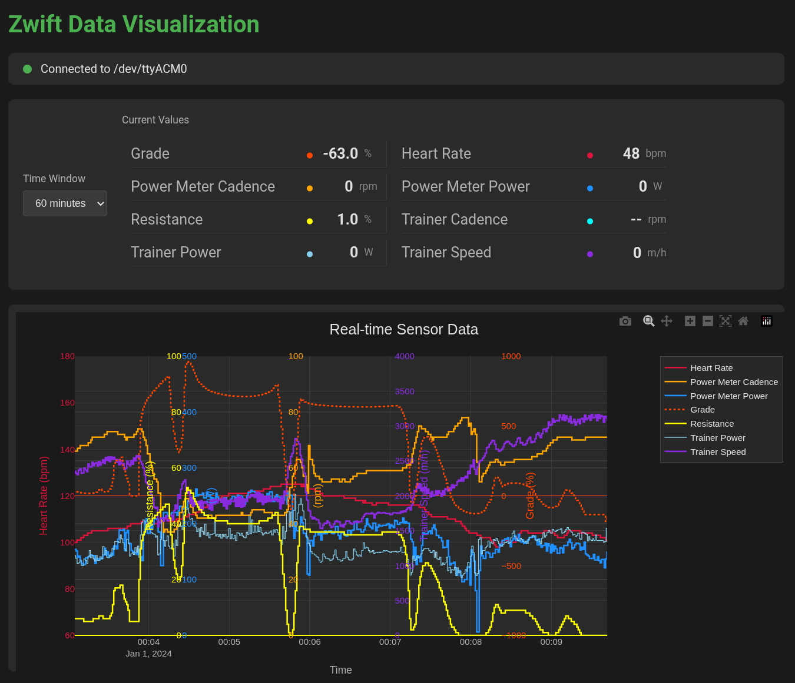

# Zwift Fitness Sensor Relay

A Bluetooth Low Energy (BLE) relay system that sits between fitness sensors (HR strap, power meter, smart trainer) and Zwift, enabling debugging of BLE traffic and working around incorrect handling of the "Set Indoor Bike Simulation Parameters" (0x11) FTMS control point command in the current smartroller firmware.
The relay converts Zwift's `FTMS_CP_SET_INDOOR_BIKE_SIM` calls to `FTMS_CP_SET_TARGET_RESISTANCE`, which the trainer handles perfectly. The result is smooth, constant resistance during climbing!

## Project Overview

This project consists of two main components:

1. **Dongle Firmware** (`dongle/`): Custom firmware for an nRF52840 dongle that acts as a BLE relay
2. **Visualization Server** (`server/`): Python Flask web server for real-time data visualization

## Architecture

```
Zwift <-> Companion App <-> Fitness Relay (this firmware) <-> Sensors (Polar H10, Favero Assioma, TruTrainer)
```

## Features

### Dongle Firmware
- **Multi-sensor support**: Heart Rate, Cycling Power, and Fitness Machine Service (FTMS)
- **Dual role operation**: Acts as both BLE central (connects to sensors) and peripheral (advertises to Zwift)
- **Persistent device storage**: Automatically saves connected devices to NVS with priority reconnection
- **Thermal management**: Adaptive grade limiting to prevent trainer overheating
- **Full FTMS support**: Including ERG mode control and bidirectional communication

### Visualization Server
- Real-time data visualization from serial port
- Time window selection (1 min, 5 min, 60 min)
- Toggle signal visibility
- Displays: Heart rate, Power meter power/cadence, Trainer speed

## Hardware Requirements

- **Hardware**: nRF52840-based dongle (e.g., `nrf52840dongle_nrf52840`)
- **Toolchain**: Zephyr SDK v4.2.99 / Nordic NCS v3.2.1, `west` build tool, and `cmake`

## Quick Start

### Dongle Firmware

See [dongle/README.md](dongle/README.md) and [dongle/project_description.md](dongle/project_description.md) for detailed build and flash instructions.

1. Build using nRF Connect VS Code extension
2. Flash using nRF Connect Desktop | Programmer
3. Monitor serial logs using nRF Serial extension

### Visualization Server

See [server/README.md](server/README.md) for detailed setup instructions.

1. Install dependencies:
```bash
cd server
pip install -r requirements.txt
```

2. Configure the serial port in `config.conf`

3. Run the server:
```bash
python run.py
```

The dashboard will be available at `http://localhost:5000`



## Project Structure

```
zwift/
├── dongle/          # nRF52840 firmware (Zephyr/NCS)
│   ├── src/         # Source code
│   ├── boards/      # Board overlays
│   └── doc/         # BLE specification documents
└── server/          # Python Flask visualization server
    ├── src/         # Python source code
    ├── static/      # Web assets
    └── templates/   # HTML templates
```

## Motivation

This project was created to debug intermittent resistance drops on a TruTrainer smartroller during specific slopes/speeds. Using a BLE relay allows the Zwift to connect to the relay instead of the sensors, enabling observation and debugging of the BLE traffic.

## License

[Add your license here]

## Contributing

[Add contribution guidelines if desired]
